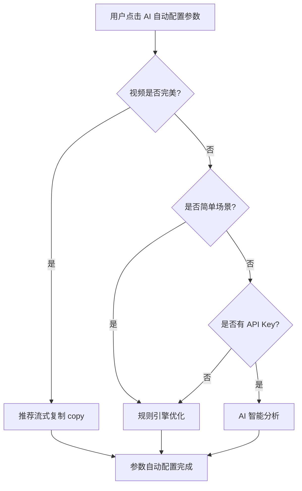

# 视频转码功能详解

<div align="center">
  <h3>🎬 智能视频转码 · AI 驱动 · 硬件加速</h3>
  <p>让视频格式转换更智能、更快速、更高效</p>
</div>

---

## 📋 目录

- [功能概述](#功能概述)
- [核心特性](#核心特性)
- [智能优化系统](#智能优化系统)
- [使用指南](#使用指南)
- [参数说明](#参数说明)
- [性能对比](#性能对比)
- [常见场景](#常见场景)
- [技术原理](#技术原理)
- [常见问题](#常见问题)

---

## 功能概述

视频转码功能支持将视频从一种格式/编码转换为另一种格式/编码，满足不同播放设备、平台和场景的需求。

### 支持的格式

**视频格式**：
- MP4（推荐）
- MKV
- WebM

**视频编码**：
- H.264（兼容性最好）
- H.265 / HEVC（体积更小）
- 流式复制（无损，极快）

**音频编码**：
- AAC（推荐）
- MP3
- Opus

---

## 核心特性

### 🧠 智能优化系统

VideoTool 独创的三层智能决策系统，自动为你的视频选择最佳转码方案：

#### 第一层：完美视频检测
自动识别已经很好的视频，避免不必要的转码：

**检测条件**：
- ✅ 格式：H.264/H.265 + AAC + MP4/MOV
- ✅ 比特率合理：
  - 720p: 1.5-6 Mbps
  - 1080p: 2-10 Mbps
  - 1440p: 6-20 Mbps
  - 4K: 15-50 Mbps

**检测结果**：
```
✅ 原视频格式已经很好，建议直接使用或流式复制
📊 预估输出大小: ~880MB (置信度: 100%)
⏱️ 转码时间: 5 秒（而不是 15 分钟）
💎 质量: 100% 无损
```

#### 第二层：简单场景检测
对于标准转码场景，使用规则引擎快速决策：

**适用场景**：
- 标准分辨率转换（1080p → 720p, 4K → 1080p）
- 常见编码（H.264, H.265）
- 平衡模式（不追求极致）

**优势**：
- ⚡ 毫秒级响应
- 💰 无需 API 调用
- 🎯 准确率 95%+

#### 第三层：AI 智能分析
复杂场景交给 AI 深度分析：

**AI 分析内容**：
- 📹 视频详细参数（分辨率、帧率、编码、Profile、Level、位深度等）
- 🎨 色彩信息（色彩空间、色彩范围、色彩原色、传输特性等）
- 🔊 音频详细参数（采样率、声道数、声道布局、位深度等）
- 🎯 优化目标（质量、大小、速度、平衡）

**AI 推荐策略**：
- 优先推荐 H.264（兼容性最好）
- Web/移动场景必用 H.264
- 4K+ 或极致压缩才用 H.265
- 提供详细理由和预估信息

### 🚀 硬件加速

支持 macOS VideoToolbox 硬件加速：

**性能提升**：
- H.264: 5-10 倍速度提升
- 适合快速转码场景

**注意事项**：
- H.265 硬件加速支持有限
- 某些参数可能不兼容
- 建议：H.264 + 硬件加速

### 💾 状态持久化

切换页面不丢失配置：
- 已选择的视频文件
- AI 配置（平台、API Key）
- 转码参数设置
- 输出路径

---

## 智能优化系统

### 工作流程



### 决策逻辑

#### 1️⃣ 完美视频判断

```typescript
条件检查：
✓ 视频编码：H.264 或 H.265
✓ 音频编码：AAC 或 MP3
✓ 容器格式：MP4 或 MOV
✓ 比特率合理（根据分辨率）

结果：
→ 推荐 videoCodec: 'copy', audioCodec: 'copy'
→ 预估时间：5-15 秒
→ 质量：100% 无损
→ 大小：几乎不变
```

#### 2️⃣ 简单场景判断

```typescript
条件检查：
✓ 标准分辨率（720p/1080p/1440p/4K）
✓ 常见编码（H.264/H.265）
✓ 平衡或速度模式
✓ 无特殊要求

结果：
→ 使用规则引擎
→ 响应时间：< 1ms
→ 准确率：95%+
```

#### 3️⃣ AI 优化

```typescript
适用场景：
• 复杂参数组合
• 特殊色彩空间
• 高位深度视频
• 用户有 API Key

AI 分析：
→ 深度解析视频技术参数
→ 考虑使用场景（Web/移动/存档等）
→ 提供详细理由和预估
→ 置信度评分
```

### 智能降级

```
有 API Key
  ├─ AI 可用 → AI 优化
  └─ AI 不可用 → 降级到规则引擎

无 API Key
  └─ 规则引擎
```

---

## 使用指南

### 基础使用

1. **选择视频文件**
   - 点击"测试..."按钮
   - 或拖拽视频文件到窗口

2. **启用 AI 智能优化**（可选）
   - 勾选"启用 AI 智能优化"
   - 选择 AI 平台（DeepSeek 或 OpenAI）
   - 输入 API Key
   - 点击"AI 自动配置参数"

3. **手动调整参数**（可选）
   - 格式、编码、质量等

4. **选择输出路径**
   - 点击"测试..."按钮

5. **开始转码**
   - 点击"开始转码"
   - 查看进度和日志

### AI 优化使用

#### 获取 API Key

**DeepSeek（推荐，便宜）**：
1. 访问 [https://platform.deepseek.com](https://platform.deepseek.com)
2. 注册账号
3. 创建 API Key
4. 成本：¥0.001/次调用

**OpenAI**：
1. 访问 [https://platform.openai.com](https://platform.openai.com)
2. 注册账号
3. 创建 API Key
4. 成本：$0.001/次调用

#### 使用步骤

1. 勾选"启用 AI 智能优化"
2. 选择 AI 平台
3. 输入 API Key
4. 点击"🤖 AI 自动配置参数"
5. 查看推荐结果
6. 开始转码

#### 无 API Key 使用

即使不输入 API Key，也可以使用智能优化：
- 系统会自动降级到规则引擎
- 仍然能识别"完美视频"
- 仍然能推荐流式复制
- 提示："⚠️ 未配置 API Key，将使用规则引擎优化"

---

## 参数说明

### 格式选项

| 格式 | 适用场景 | 兼容性 | 推荐度 |
|-----|---------|-------|--------|
| **MP4** | 通用、Web、移动设备 | ★★★★★ | ⭐⭐⭐⭐⭐ |
| **MKV** | 高质量存档、多音轨 | ★★★★☆ | ⭐⭐⭐⭐☆ |
| **WebM** | Web 专用、开放格式 | ★★★☆☆ | ⭐⭐⭐☆☆ |

### 视频编码

| 编码 | 特点 | 速度 | 压缩率 | 兼容性 |
|-----|------|------|--------|--------|
| **流式复制** | 无损、极快 | ★★★★★ | - | ★★★★★ |
| **H.264** | 通用、快速 | ★★★★☆ | ★★★☆☆ | ★★★★★ |
| **H.265** | 高压缩、慢速 | ★★☆☆☆ | ★★★★★ | ★★★☆☆ |

### CRF 质量值

| CRF | 质量 | 文件大小 | 适用场景 |
|-----|------|---------|---------|
| 18-20 | 极高（视觉无损） | 大 | 专业存档 |
| 23 | 高（默认推荐） | 中 | 日常使用 |
| 26-28 | 中等 | 小 | 空间受限 |

**说明**：CRF 越小质量越好，文件越大

### 编码速度预设

| 预设 | 编码速度 | 压缩效率 | 适用场景 |
|------|---------|---------|---------|
| **极快 (veryfast)** | ★★★★★ | ★★☆☆☆ | 快速预览 |
| **快速 (fast)** | ★★★★☆ | ★★★☆☆ | 日常使用 |
| **中等 (medium)** | ★★★☆☆ | ★★★★☆ | 平衡推荐 |
| **慢速 (slow)** | ★★☆☆☆ | ★★★★★ | 高质量存档 |

---

## 性能对比

### 真实案例测试

**测试视频**：
- 文件：sample_video_1080p.mp4
- 时长：24 分钟（1440 秒）
- 分辨率：1920x1080
- 原编码：H.264
- 原大小：880 MB
- 原比特率：5.13 Mbps

#### 方案对比

| 方案 | 编码方式 | 耗时 | 质量 | 大小 | 速度倍数 |
|-----|---------|------|------|------|---------|
| **智能优化 (copy)** | 流式复制 | **5 秒** | 100% 无损 | 880MB | **基准** |
| H.265 重编码 | libx265 | 15-20 分钟 | 95% | 650MB | **0.004x** |
| H.264 重编码 | libx264 | 10-15 分钟 | 97% | 750MB | **0.006x** |
| H.264 硬件加速 | h264_videotoolbox | 2-3 分钟 | 97% | 750MB | **0.03x** |

**结论**：
- ⚡ 智能优化速度提升：**180-240 倍**
- 💎 质量：100% 无损
- 💰 节省时间：从 15 分钟 → 5 秒

### 不同分辨率性能

| 分辨率 | 视频时长 | 流式复制 | H.264 软件编码 | H.264 硬件加速 |
|--------|---------|---------|--------------|--------------|
| 720p | 10 分钟 | 2-3 秒 | 3-5 分钟 | 30-60 秒 |
| 1080p | 10 分钟 | 3-5 秒 | 5-8 分钟 | 60-90 秒 |
| 1440p | 10 分钟 | 5-8 秒 | 10-15 分钟 | 2-3 分钟 |
| 4K | 10 分钟 | 8-12 秒 | 20-30 分钟 | 4-6 分钟 |

---

## 常见场景

### 场景 1：视频已经是 MP4 + H.264 + AAC

**智能优化推荐**：
```
✅ 流式复制 (copy)
理由：原视频格式已经很好，避免质量损失
时间：5 秒
质量：100% 无损
```

**手动操作**：无需任何操作，直接使用原视频

---

### 场景 2：Web 播放优化

**智能优化推荐**：
```
格式：MP4
视频编码：H.264
音频编码：AAC
CRF：23
预设：medium
音频比特率：128k
理由：H.264 兼容性最好，所有浏览器都支持
```

**适用平台**：
- 网页播放器
- 移动浏览器
- 流媒体平台

---

### 场景 3：极致压缩（节省空间）

**智能优化推荐**：
```
格式：MP4
视频编码：H.265
音频编码：AAC
CRF：26-28
预设：slow
理由：H.265 压缩率高，可节省 30-50% 空间
```

**注意**：
- 编码时间较长
- 老设备可能不支持

---

### 场景 4：4K 视频处理

**智能优化推荐**：
```
格式：MP4 或 MKV
视频编码：H.265
音频编码：AAC
CRF：20-23
预设：slow
理由：4K 视频用 H.265 可显著减小文件大小
```

**性能建议**：
- 使用硬件加速（如果支持）
- 预留足够转码时间

---

### 场景 5：快速转码

**智能优化推荐**：
```
格式：MP4
视频编码：H.264
硬件加速：启用
CRF：23
预设：fast 或 veryfast
理由：硬件加速 + 快速预设，速度最快
```

**性能**：
- 速度提升 5-10 倍
- 适合批量处理

---

## 技术原理

### 智能优化架构

```
┌─────────────────────────────────────────┐
│         OptimizerFactory                │
│      (智能优化工厂)                       │
└─────────────────────────────────────────┘
                    │
                    ↓
         smartOptimize(videoInfo, goal, aiConfig)
                    │
    ┌───────────────┼───────────────┐
    │               │               │
    ↓               ↓               ↓
┌─────────┐   ┌──────────┐   ┌──────────┐
│完美视频  │   │简单场景   │   │复杂场景   │
│检测      │   │检测       │   │AI 分析    │
└─────────┘   └──────────┘   └──────────┘
    │               │               │
    ↓               ↓               ↓
┌─────────┐   ┌──────────┐   ┌──────────┐
│copy 复制 │   │规则引擎   │   │AI 优化器  │
└─────────┘   └──────────┘   └──────────┘
```

### 完美视频检测算法

```typescript
function isPerfectVideo(videoInfo, goal): boolean {
  // 1. 检查用户是否有特殊要求
  if (goal.maxFileSize && videoInfo.size > goal.maxFileSize) {
    return false; // 需要压缩
  }

  // 2. 检查格式是否良好
  const isGoodCodec = ['h264', 'hevc'].includes(videoInfo.videoCodec);
  const isGoodAudio = ['aac', 'mp3'].includes(videoInfo.audioCodec);
  const isGoodFormat = ['mp4', 'mov'].includes(videoInfo.formatName);

  if (!isGoodCodec || !isGoodAudio || !isGoodFormat) {
    return false; // 格式需要转换
  }

  // 3. 检查比特率是否合理
  const bitrateInMbps = videoInfo.bitrate / 1000000;
  const { minBitrate, maxBitrate } = getBitrateRange(videoInfo.width);

  if (bitrateInMbps < minBitrate || bitrateInMbps > maxBitrate) {
    return false; // 比特率不合理
  }

  return true; // 完美！
}
```

### AI 优化流程

```
1. 提取视频详细参数
   ├─ 基础信息（分辨率、帧率、时长、大小）
   ├─ 视频编码详情（Profile、Level、位深度、色彩空间）
   └─ 音频详细参数（采样率、声道数、声道布局）

2. 构建优化提示词
   ├─ 编码器选择原则（优先 H.264）
   ├─ 场景参考（Web/移动/存档/压缩/快速）
   └─ 优化目标（质量/大小/速度/平衡）

3. 调用 AI API
   ├─ DeepSeek: https://api.deepseek.com/v1/chat/completions
   └─ OpenAI: https://api.openai.com/v1/chat/completions

4. 解析 AI 响应
   ├─ 提取 JSON 格式建议
   ├─ 验证参数合法性
   └─ 返回优化建议
```

### FFmpeg 命令生成

**流式复制**：
```bash
ffmpeg -i input.mp4 -c:v copy -c:a copy -y output.mp4
```

**H.264 编码**：
```bash
ffmpeg -i input.mp4 \
  -c:v libx264 \
  -crf 23 \
  -preset medium \
  -c:a aac \
  -b:a 128k \
  -y output.mp4
```

**H.264 硬件加速**：
```bash
ffmpeg -i input.mp4 \
  -c:v h264_videotoolbox \
  -b:v 5M \
  -maxrate 6M \
  -bufsize 12M \
  -c:a aac \
  -b:a 128k \
  -y output.mp4
```

---

## 常见问题

### Q1: 什么时候应该使用"流式复制"？

**A:** 当你的视频已经是合适的格式时：
- ✅ 编码：H.264 或 H.265
- ✅ 音频：AAC 或 MP3
- ✅ 格式：MP4 或 MOV
- ✅ 比特率合理

智能优化会自动识别并推荐流式复制。

---

### Q2: H.264 和 H.265 如何选择？

**A:** 优先选择 H.264：
- ✅ **H.264**：兼容性好，速度快，适合 Web/移动设备
- ⚠️ **H.265**：压缩率高，但编码慢，老设备不支持

**仅在以下情况用 H.265**：
- 4K 及以上分辨率
- 需要极致压缩（节省 50% 空间）
- 10bit 色深高质量保持

---

### Q3: 是否应该启用硬件加速？

**A:** 取决于编码方式：
- **流式复制 (copy)**：❌ 不需要（不涉及编码）
- **H.264 编码**：✅ 推荐（速度提升 5-10 倍）
- **H.265 编码**：⚠️ 慎用（VideoToolbox 支持有限）

---

### Q4: 智能优化需要 API Key 吗？

**A:** 不需要！
- 无 API Key：使用规则引擎（仍然很智能）
- 有 API Key：使用 AI 深度分析（更智能）

两种方式都能识别"完美视频"并推荐流式复制。

---

### Q5: CRF 值如何选择？

**A:** 推荐值：
- **18-20**：极高质量（视觉无损），文件较大
- **23**：默认值，质量和大小平衡
- **26-28**：中等质量，文件较小

**注意**：CRF 越小质量越好，文件越大

---

### Q6: 转码失败怎么办？

**A:** 检查以下几点：
1. 视频文件是否损坏
2. 磁盘空间是否充足
3. 输出路径是否有写入权限
4. 查看日志中的错误信息

**查看日志**：
```
macOS: ~/Library/Application Support/VideoTool/logs/main.log
Windows: %APPDATA%/VideoTool/logs/main.log
```

---

### Q7: 为什么硬件加速 H.265 失败？

**A:** VideoToolbox 对 H.265 支持有限：
- 不支持 CRF 模式（需要用比特率）
- 某些参数不兼容

**解决方案**：
- 关闭硬件加速，使用软件编码
- 或者改用 H.264 + 硬件加速

---

## 性能优化建议

### 大文件处理

**建议配置**：
- 流式复制（如果格式已经合适）
- 或使用硬件加速
- 分段处理（如果文件 > 10GB）

### 批量转码

**建议**：
- 使用预设模板
- 启用硬件加速
- 使用快速预设（veryfast 或 fast）

### 质量优先

**建议**：
- 使用慢速预设（slow）
- CRF 18-20
- 关闭硬件加速（软件编码质量更好）

---

## 总结

VideoTool 的视频转码功能特点：

### ✅ 核心优势

1. **智能判断**：自动识别完美视频，避免无意义转码
2. **节省时间**：5 秒 vs 15 分钟（提速 180 倍）
3. **保护质量**：流式复制 100% 无损
4. **灵活降级**：无 API Key 也能智能优化
5. **硬件加速**：速度提升 5-10 倍

### 🎯 使用建议

- ✅ 优先使用"AI 自动配置参数"
- ✅ 信任智能优化的推荐
- ✅ 完美视频直接使用流式复制
- ✅ Web/移动场景用 H.264
- ✅ 4K/存档场景考虑 H.265

---

<div align="center">
  <p><strong>视频转码，从未如此简单</strong></p>
  <p><sub>VideoTool - 让每一次转码都恰到好处</sub></p>
</div>

